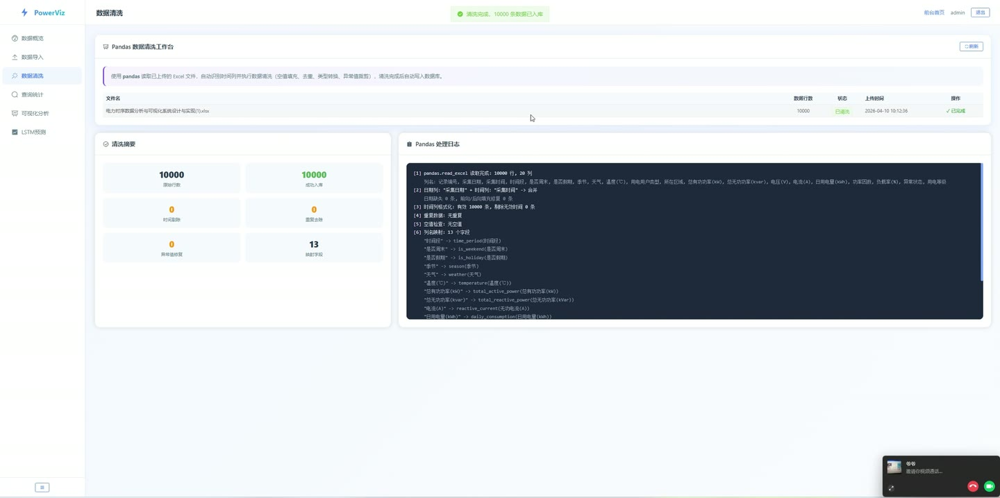
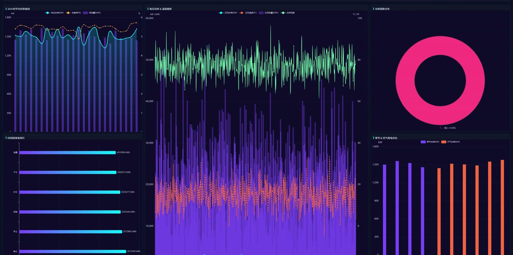
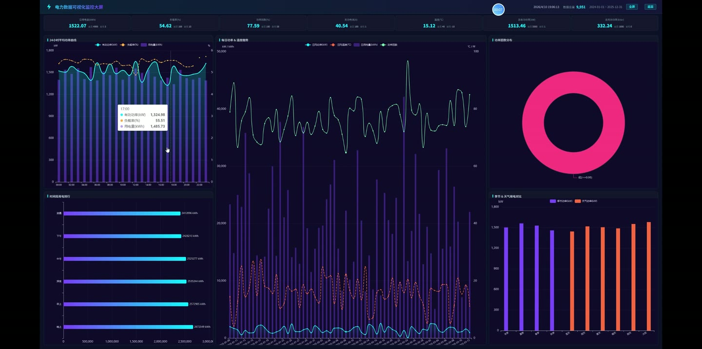
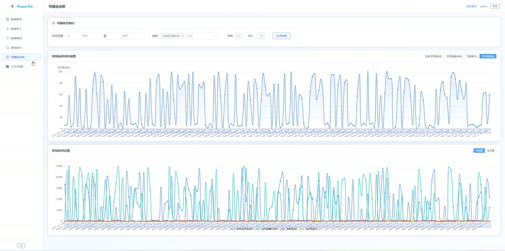
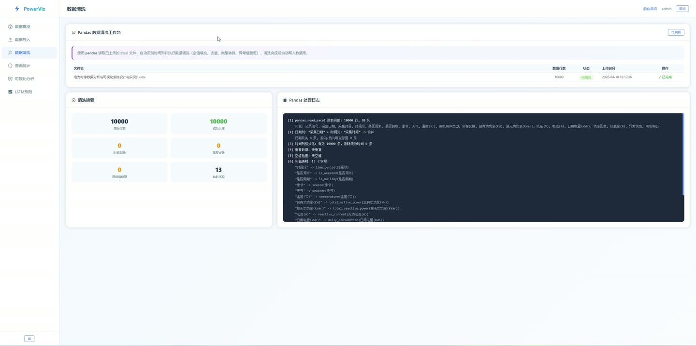

# (附文档)Python+Flask+PyTorch 电力时序数据分析与可视化系统

**技术栈**：Python、Flask、PyTorch、深度学习、Vue3

### 系统简介

本系统是一套基于 Python + Flask + PyTorch 的电力时序数据分析与可视化平台，采用前后端分离架构。后端基于 Flask 提供 RESTful 接口，集成 PyTorch 深度学习框架实现 LSTM 时序预测；前端基于 Vue3 + Element Plus + ECharts 构建管理后台与可视化大屏。系统包含管理员端与访客端两类角色，覆盖数据导入、清洗、查询统计、可视化分析、LSTM 预测、可视化大屏等完整业务链路。
 
### 核心功能
 
### 管理员端

 
- 账号登录：输入用户名与密码进行身份校验，登录成功后签发 token 并写入本地存储，支持管理员一键快捷登录。 
- 数据概览：展示数据总量、上传次数、预测次数、监测指标数四张统计卡片，并渲染近 7 天总有功功率趋势折线图与用电量/负载率组合图。 
- 最近记录查看：在概览页表格中查看最近上传记录（文件名、记录数、上传时间）与最近预测结果（预测时间、预测值、实际值、模型名）。 
- 数据导入：拖拽或点击选择 .xlsx 文件上传，自动识别并展示原始列名，记录原始行数与上传时间，生成待清洗记录。 
- 上传记录管理：查看全部上传记录列表，展示文件名、数据行数、状态（待清洗/已清洗）、上传时间与清洗时间。 
- 数据清洗：对指定上传记录执行 Pandas 清洗，自动识别时间列，执行空值填充、去重、类型转换、异常值裁剪后写入数据库。 
- 清洗摘要查看：展示原始行数、成功入库数、时间剔除数、重复去除数、异常值修复数与映射字段数六项统计。 
- 清洗日志查看：以终端风格展示 Pandas 逐步处理日志，包含字段映射与每步处理明细。 
- 数据查询：按自定义时间范围与多选监测指标进行联合查询，支持分页浏览查询结果表格。 
- 查询统计：对查询结果按指标展示最大值、最小值、平均值三类统计指标。 
- 可视化分析：选择时间范围、多指标与采样条数生成图表，支持单指标时序折线图与多指标对比图（折线/柱状切换），内置区域缩放。 
- LSTM 预测：选择预测指标、预测步数与序列长度，调用 PyTorch LSTM 模型生成未来时序预测值并渲染预测曲线。 
- 预测预警：根据预测结果自动生成提示/警告/严重三级预警，展示触发次数与时间范围，并对严重预警弹出强提醒。 
- 预测明细与历史：查看本次预测数据明细表与历史预测记录（预测时间、指标、预测值、实际值、模型名、创建时间）。 
- 可视化大屏：进入全屏监控大屏，展示数据总量、时间范围、实时时钟与九项指标统计条，渲染 24 小时平均功率曲线、区域/时段用电排行、每日功率与温度趋势、功率因数分布、季节与天气用电对比五类图表。 
- 轮播图管理：获取、上传与删除首页轮播图资源，支持头像上传。 
- 退出登录：清除本地 token 与用户信息并跳转至登录页。
 
### 访客端

 
- 首页浏览：查看系统品牌介绍、核心指标数据与实时功率趋势动画展示。 
- 数据展示轮播：浏览电力数据可视化轮播图，支持接口动态加载与图片加载失败兜底。 
- 功能特性浏览：查看数据导入与存储、基础查询与统计、可视化展示、LSTM 智能预测四大功能卡片介绍。 
- 进入系统：通过导航按钮跳转至登录页进入后台管理系统。
 
### 技术栈

 后端框架Python + Flask，Blueprint 分模块路由 深度学习PyTorch，LSTM 长短期记忆网络时序预测 数据处理Pandas，Excel 解析、清洗、去重与异常值处理 跨域与鉴权Flask-CORS 跨域支持，Token 鉴权 前端框架Vue3 + Vue Router 路由守卫 UI 组件Element Plus 组件库 可视化ECharts 折线图、柱状图、饼图、双轴组合图 网络请求Axios 拦截器统一处理 token 与错误提示 构建工具Vite 数据库关系型数据库，存储电力时序数据、上传记录、预测结果与轮播图
 
### 交付内容

 
- 后端完整源码 
- 前端完整源码 
- 数据库初始化脚本 
- 万字文档

## 界面展示

---

## 获取完整源码 + 万字文档

本仓库为项目介绍页。**完整前后端源码、数据库初始化脚本、万字项目文档**，请加微信 `kangkangcode`，或访问 [codekk.top](http://codekk.top) 获取。

可作课程设计 / 毕业设计参考，支持远程部署调试。